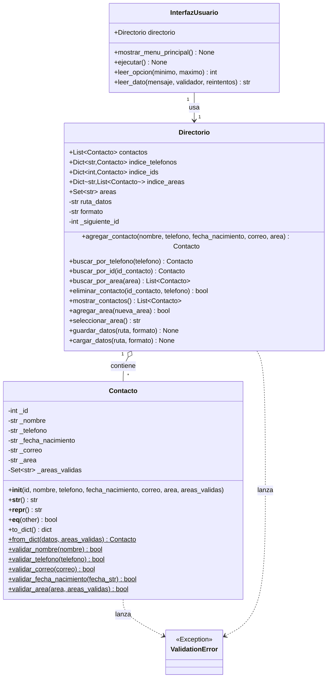

# Lab 3 — Directorio telefónico con clases, listas y diccionarios

Sistema de gestión de contactos implementado en Python con Programación
Orientada a Objetos. Modela contactos con la clase `Contacto`, los organiza
en la clase `Directorio` (lista + diccionarios de índice para búsqueda O(1))
y expone una interfaz de consola con la clase `InterfazUsuario`.

## Contenido del entregable

| Archivo | Descripción |
|---|---|
| `directorio_telefonico.py` | Código fuente completo (las tres clases + `main()`). |
| `test_directorio_telefonico.py` | 44 casos de prueba (`unittest`) sobre validaciones, `Contacto` y `Directorio`. |
| `contactos_ejemplo.json` | Archivo de persistencia de ejemplo en formato JSON. |
| `contactos_ejemplo.csv` | Archivo de persistencia de ejemplo en formato CSV. |
| `README.md` | Este documento. |

## 1. Diagrama de clases



`$` denota método estático/de clase en la notación Mermaid.

## 2. Explicación de cada clase

### 2.1 `Contacto`

Entidad de dominio. La decisión de diseño central es exponer cada atributo
como una **propiedad** (`@property` / `@x.setter`) en lugar de atributos
públicos simples. Esto significa que la validación no ocurre solo en
`__init__`, sino en **cualquier** asignación posterior:

```python
c = Contacto(1, "Juan Pérez", "5512345678", "1990-05-15", "juan@empresa.com", "Ventas")
c.telefono = "abc"  # ValidationError, no un estado corrupto silencioso
```

Esto es una garantía de invariante de clase: un objeto `Contacto`, una vez
construido, **nunca** puede quedar en un estado inválido durante su ciclo
de vida, incluso si otro módulo lo modifica directamente.

Las funciones `validar_*` son `@staticmethod` porque no dependen de una
instancia: se reutilizan tanto en los *setters* de las propiedades como en
`InterfazUsuario.leer_dato()` para validar la entrada del usuario *antes*
de intentar construir el objeto (mejor experiencia de usuario: el mensaje
de error aparece de inmediato, sin abortar todo el flujo de alta).

`validar_area()` recibe opcionalmente un conjunto `areas_validas`. Esto
resuelve una tensión de diseño: la validez de un área depende del catálogo
que vive en `Directorio`, pero `Contacto` no debería depender de
`Directorio` (evita un acoplamiento circular). La solución es inyectar el
conjunto de áreas válidas como parámetro opcional; si no se provee, solo se
valida que el área sea una cadena no vacía (caso usado, por ejemplo, al
deserializar un registro antes de que el catálogo esté completamente
poblado).

**Sobre `validar_correo`**: se usa un patrón práctico (el mismo subconjunto
que aplican HTML5 `<input type="email">` o el validador de Django) en lugar
de implementar la gramática completa de RFC 5322, que es notoriamente
compleja y permite direcciones sintácticamente válidas pero inservibles en
la práctica (p. ej. direcciones sin dominio con TLD). Es la decisión estándar
en la industria; se documenta aquí explícitamente como *trade-off* consciente.

### 2.2 `Directorio`

Colección de contactos con **tres índices** mantenidos en paralelo a la
lista maestra `contactos`, para lograr complejidad O(1) amortizada en las
tres búsquedas más frecuentes:

- `indice_telefonos: Dict[str, Contacto]` — unicidad de teléfono.
- `indice_ids: Dict[int, Contacto]` — acceso directo por ID.
- `indice_areas: Dict[str, List[Contacto]]` — listar contactos de un área
  sin recorrer toda la colección.

**Consistencia de índices**: toda mutación (`agregar_contacto`,
`eliminar_contacto`) actualiza los tres índices de forma atómica dentro del
mismo método, para que nunca queden desincronizados entre sí. Esto se
verifica explícitamente en las pruebas (`test_eliminar_contacto_por_id_mantiene_consistencia`).

**Generación de ID sin huecos**: `agregar_contacto()` valida *todos* los
campos (incluyendo unicidad de teléfono y pertenencia del área al
catálogo) **antes** de invocar `_generar_id()`. Si la validación falla, no
se consume ningún ID. Esto evita que intentos fallidos generen saltos en
la numeración (p. ej. 1, 2, 5, 6 tras tres intentos fallidos), lo cual
sería confuso para el usuario final y una mala práctica de diseño de
identificadores.

**Persistencia (`guardar_datos` / `cargar_datos`)**: soporta JSON y CSV de
forma intercambiable mediante el parámetro `formato`. `agregar_contacto()`
y `eliminar_contacto()` guardan automáticamente por defecto
(`guardar=True`), cumpliendo el requisito de que el alta “agregue
validando los datos y guardando automáticamente”. `cargar_datos()` es
tolerante a fallos parciales: si un registro individual está corrupto o
es inválido, se omite con una advertencia (vía el módulo `logging`) en
lugar de abortar la carga completa de los demás contactos — una decisión
deliberada de robustez frente a archivos de datos editados manualmente.

### 2.3 `InterfazUsuario`

Capa de presentación, deliberadamente delgada: no contiene lógica de
negocio ni accede a los índices de `Directorio` directamente, solo llama a
su API pública. Esto permite, por ejemplo, sustituir esta interfaz de
consola por una interfaz gráfica o una API REST sin tocar `Contacto` ni
`Directorio` (principio de responsabilidad única / separación de capas).

`leer_dato()` centraliza el patrón "leer → validar → reintentar" para
todos los campos de texto, con un número máximo de reintentos configurable,
evitando bucles infinitos ante entradas repetidamente inválidas.

## 3. Validaciones implementadas

| Campo | Regla |
|---|---|
| `nombre` | ≥ 2 palabras, ≥ 5 caracteres, solo letras (incluye acentos/ñ) y espacios. |
| `telefono` | Exactamente 10 caracteres, todos dígitos 0-9. |
| `correo` | Formato `usuario@dominio.extension` (patrón práctico tipo HTML5/Django). |
| `fecha_nacimiento` | ISO 8601 `YYYY-MM-DD`, día calendario real (usa `datetime.strptime`, que rechaza p. ej. `2023-02-30`), rango `1925-01-01` ≤ fecha ≤ hoy. |
| `area` | Cadena no vacía; si se provee un catálogo, debe pertenecer a él. |

## 4. Instrucciones de uso

### Requisitos
Python ≥ 3.9 (usa `from __future__ import annotations` y tipado con
genéricos estándar). Sin dependencias externas — solo librería estándar
(`json`, `csv`, `re`, `datetime`, `logging`, `os`).

### Ejecutar la aplicación interactiva
```bash
python3 directorio_telefonico.py
```
Al iniciar, carga automáticamente `contactos.json` si existe en el
directorio actual; si no existe, arranca con un directorio vacío y seis
áreas predeterminadas (Ventas, Recursos Humanos, Tecnología, Finanzas,
Operaciones, Dirección General).

### Ejecutar las pruebas
```bash
python3 -m unittest test_directorio_telefonico.py -v
# o, si tienes pytest instalado:
pytest test_directorio_telefonico.py -v
```

### Usar las clases programáticamente
```python
from directorio_telefonico import Directorio

d = Directorio(ruta_datos="contactos.json", formato="json")
contacto = d.agregar_contacto(
    nombre="Juan Pérez",
    telefono="5512345678",
    fecha_nacimiento="1990-05-15",
    correo="juan@empresa.com",
    area="Ventas",
)
print(contacto)                       # ID: 1 | Juan Pérez | ☎ 5512345678 | Ventas
print(d.buscar_por_telefono("5512345678"))
for c in d.mostrar_contactos():
    print(c)
```

### Cambiar a persistencia CSV
```python
d = Directorio(ruta_datos="contactos.csv", formato="csv")
```

## 5. Posibles extensiones (fuera del alcance de este laboratorio)

- Reemplazar `print`/`input` por una capa de logging estructurado y una
  interfaz desacoplada de I/O (inyección de un "puerto" de entrada/salida),
  para facilitar pruebas de `InterfazUsuario` sin *monkeypatching* de `input`.
  Se aplica en este proyecto el `monkeypatching` de builtins como técnica
  de prueba pragmática para verificar el flujo interactivo (ver el smoke
  test usado durante el desarrollo, ejecutado con `builtins.input` sustituido).
- Persistencia concurrente (bloqueo de archivo) si se convierte en un
  servicio multiusuario.
- Migrar de una validación por regex de correo a una verificación real de
  entregabilidad (SMTP handshake) si el caso de uso lo exige — normalmente
  no se recomienda por el costo y los falsos negativos que introduce.
